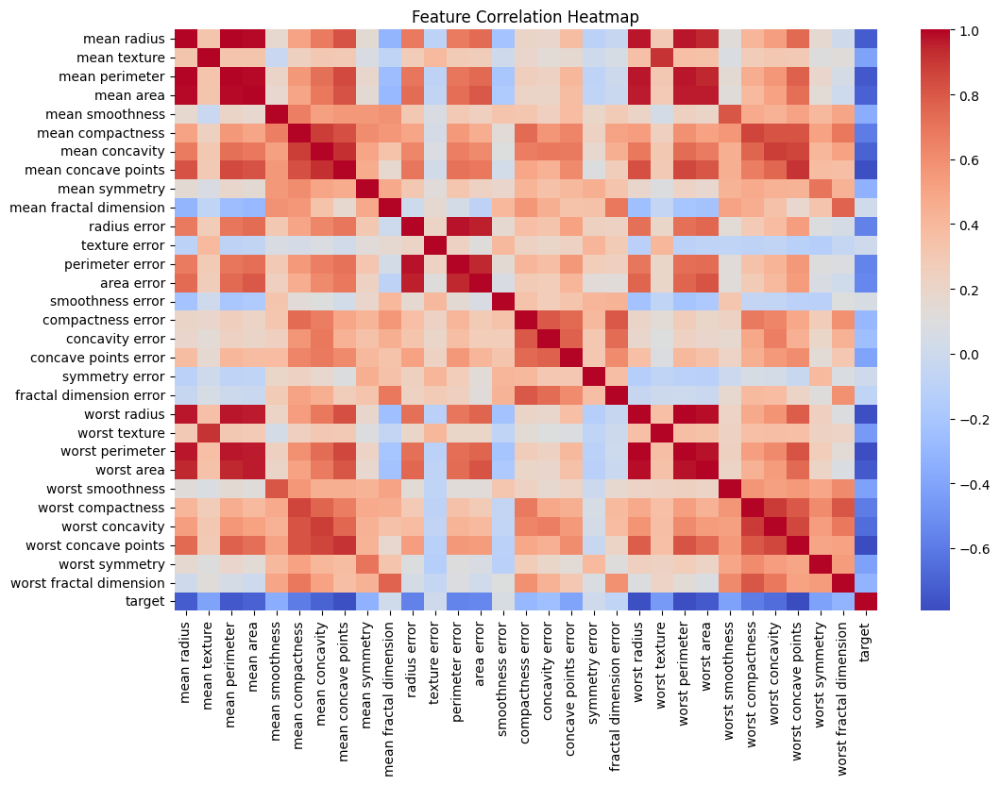
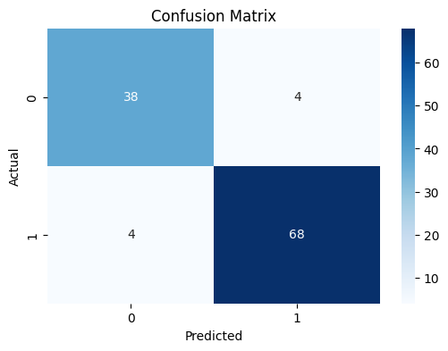
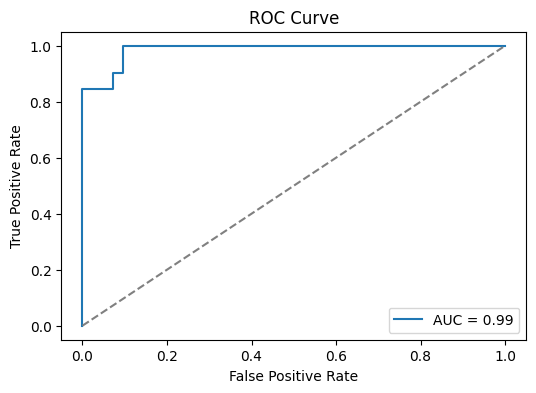

# Cancer Prediction using Naïve Bayes

## Overview
This project focuses on predicting whether a breast tumor is malignant or benign using machine learning.
A Gaussian Naïve Bayes classifier is trained and evaluated on the Breast Cancer Wisconsin dataset.

## Dataset
- Source: Scikit-learn built-in Breast Cancer dataset
- Samples: 569
- Features: 30 numeric features
- Target:
  - 0 → Malignant
  - 1 → Benign

## Tech Stack
- Python
- Pandas, NumPy
- Scikit-learn
- Matplotlib, Seaborn

## Project Workflow
1. Data loading and exploratory data analysis (EDA)
2. Feature engineering and scaling
3. Train-test split using stratified sampling
4. Model training using Gaussian Naïve Bayes
5. Model evaluation using confusion matrix, precision, recall, F1-score, and ROC-AUC

## Model Performance
- Accuracy: ~95%
- Strong precision and recall across both classes
- High ROC-AUC score indicating good class separation

## Visualizations
### Correlation Heatmap

### Confusion Matrix

### ROC Curve

## Conclusion
The Gaussian Naïve Bayes model performs well on this dataset and demonstrates the effectiveness of probabilistic classifiers for medical diagnosis problems.

## Future Improvements
- Hyperparameter tuning
- Comparison with other classifiers
- Deployment using Flask
